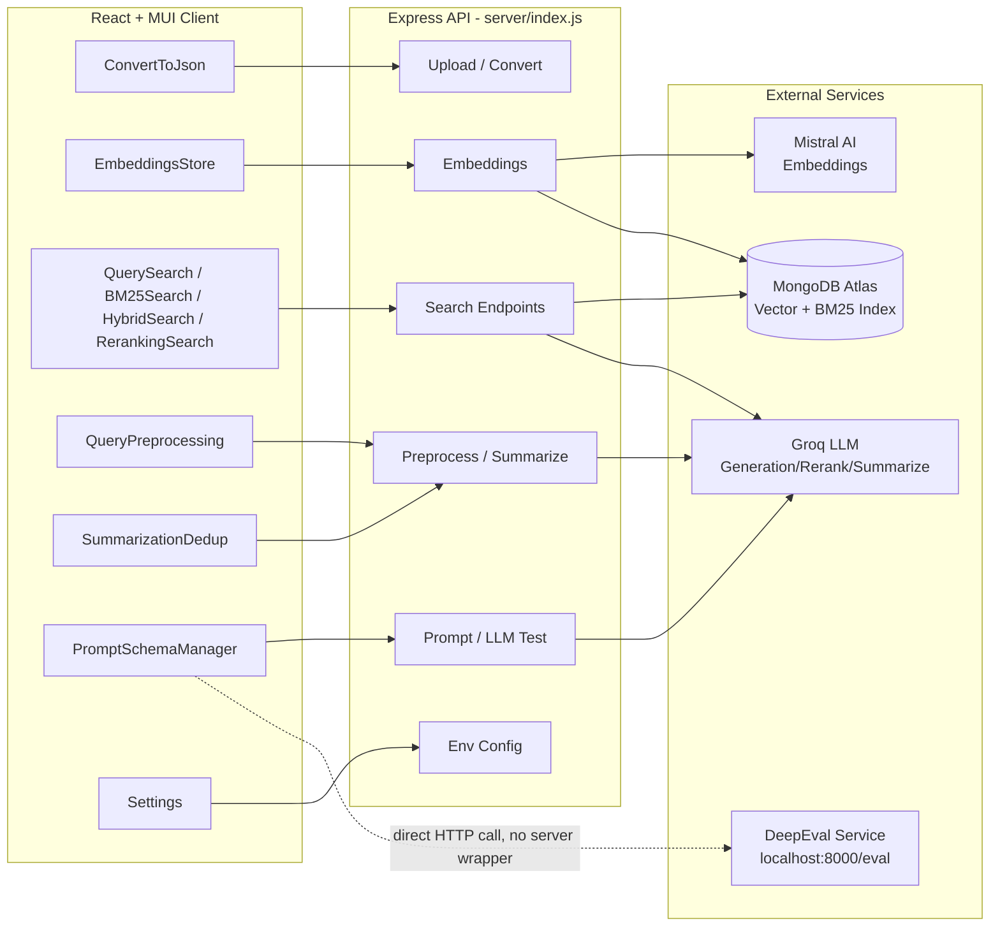

# RAG_MONGO_TC_EVAL

An end-to-end **RAG (Retrieval-Augmented Generation) toolkit for Test Case management** in a healthcare domain context. It combines MongoDB Atlas Vector Search + BM25 keyword search, Mistral AI embeddings, Groq LLM-powered generation/reranking/summarization, and DeepEval-based quality evaluation — all wrapped in a React/Material-UI front end with an Express backend.

## 1. What This Project Does

Given a set of **User Stories** and **Test Cases** (imported from Excel or Jira), this app lets you:

1. **Convert & ingest data** — Upload Excel sheets of test cases/user stories and convert them to structured JSON.
2. **Create embeddings** — Batch-generate vector embeddings (Mistral AI) for test cases and user stories, stored in MongoDB Atlas.
3. **Search** — Retrieve relevant test cases/user stories via:
   - **Vector search** (semantic similarity)
   - **BM25 search** (keyword, field-weighted)
   - **Hybrid search** (BM25 + Vector, adjustable weighting)
   - **Reranking search** (score fusion + Groq LLM reranking)
4. **Preprocess queries** — Normalize text, expand healthcare abbreviations (e.g., UHID, PHI, HIPAA), and apply domain-specific synonym expansion before search.
5. **Deduplicate & summarize** — Remove redundant search results and generate AI summaries via Groq.
6. **Generate & manage prompts** — Configure JSON schemas and prompt templates (ICEPOT framework), run RAG-based test case generation, and test LLM responses.
7. **Evaluate quality** — Send generated test cases to an external **DeepEval** service to score them on faithfulness, answer relevancy, contextual precision/recall, and hallucination.
8. **Configure environment** — View/edit environment variables (MongoDB URI, DB/collection names, API keys) from the UI.

## 2. Architecture Overview



## 3. Project Structure

```
package.json                 # Root Node/Express dependencies & scripts
server/
  index.js                   # Express API server (uploads, search, embeddings, env config)
client/                      # React front end (Create React App + MUI)
  src/
    App.js                   # Shell layout, navigation, theming
    components/
      data/
        ConvertToJson.js     # Excel -> JSON conversion UI
        EmbeddingsStore.js   # Batch embedding creation & vector store management
      processing/
        PromptSchemaManager.js   # Prompt/schema config, RAG generation, Metrics Evaluation (DeepEval)
        QueryPreprocessing.js    # Query normalization/abbreviation/synonym pipeline UI
        SummarizationDedup.js    # Dedup + AI summarization UI
      search/
        QuerySearch.js       # Vector search UI
        BM25Search.js         # Keyword (BM25) search UI
        HybridSearch.js       # BM25 + Vector hybrid search UI
        RerankingSearch.js    # Score fusion + Groq reranking UI
      settings/
        Settings.js           # Environment variable configuration UI
releases/                    # Sample user story data by release
src/
  config/                    # Generated index config JSON files (vector/bm25 index defs)
  data/                      # Converted JSON data output
  scripts/
    data-conversion/         # excel-to-json, excel-to-userstories, fetch-jira-stories
    embeddings/               # Batch Mistral embedding creation scripts (test cases & user stories)
    query-preprocessing/      # normalizer, abbreviationMapper, synonymExpander, dictionaries, orchestrator
    search/                   # bm25-search, rerank-search, score-fusion-search, vector search, combined search
    utilities/                # mistralEmbedding, groqClient, delete-all-documents
uploads/                      # Uploaded Excel files
```

## 4. Prerequisites

- Node.js (LTS) and npm
- A MongoDB Atlas cluster with Vector Search + Search (BM25) indexes configured
- API keys for:
  - Mistral AI (embeddings)
  - Groq (LLM generation/reranking/summarization)
- A running **DeepEval** service exposed at `http://localhost:8000/eval` (external, Python-based; not included in this repo) for the Metrics Evaluation tab to work

## 5. Setup & Running

```powershell
# From the repository root
npm install          # installs root deps, and via postinstall also installs client deps

# Configure environment variables (MongoDB URI, DB/collection names, API keys)
# either via a .env file consumed by server/index.js, or via the in-app Settings page

# Run both server and client together
npm run dev

# Or run individually
npm run server       # starts Express API (server/index.js)
npm run client       # starts the React dev server (client/)

# Production build of the client
npm run build
```

By default the client dev server proxies/talks to the Express API, and the Metrics Evaluation feature additionally requires a separately running DeepEval service on port 8000.

## 6. Key Features by Tab (Client UI)

| Tab / Component | Purpose |
|---|---|
| Convert to JSON | Upload Excel files of test cases/user stories, map columns, export JSON |
| Embeddings Store | Batch-create Mistral embeddings, track job progress, manage vector store |
| Query Search | Semantic vector search with DataGrid results and metadata filters |
| BM25 Search | Field-weighted keyword search |
| Hybrid Search | Adjustable-weight BM25 + Vector combined search |
| Reranking Search | Score fusion + Groq LLM reranking with before/after comparison |
| Query Preprocessing | Normalize, expand abbreviations, apply synonyms to raw queries |
| Summarization & Dedup | Remove redundant results, summarize via Groq |
| Prompt & Schema Manager | Configure ICEPOT prompt schemas, run RAG generation, evaluate metrics via DeepEval |
| Settings | Edit environment variables (Mongo URI, DB/collection names, API keys) |

## 7. Backend API Summary (`server/index.js`)

| Category | Endpoints |
|---|---|
| Health & Jobs | `GET /api/health`, `GET /api/jobs/active`, `GET /api/jobs/:jobId` |
| Metadata | `GET /api/metadata/distinct` |
| Files | `GET /api/files`, `POST /api/upload-excel` |
| Embeddings | `POST /api/create-embeddings`, `POST /api/create-embeddings-batch` |
| Search | `POST /api/search`, `POST /api/search/bm25`, `POST /api/search/hybrid`, `POST /api/search/rerank`, `POST /api/search/vector`, `POST /api/search/user-stories` |
| Processing | `POST /api/search/preprocess`, `POST /api/search/analyze`, `POST /api/search/deduplicate`, `POST /api/search/summarize` |
| LLM | `POST /api/test-prompt` |
| Config | `GET /api/env`, `POST /api/env` |

Note: There is currently **no server-side wrapper for DeepEval** — the client calls `http://localhost:8000/eval` directly.

## 8. Enhancements

Planned and in-progress enhancements are tracked in [enhancement.md](enhancement.md).

### Current Enhancement: Multi-Select Metrics Dropdown for DeepEval Evaluation

**Goal**: In the Metrics Evaluation tab of `PromptSchemaManager.js`, replace the hardcoded `metric: 'all'` DeepEval request with a **multi-select dropdown** so users can choose exactly which metrics (`faithfulness`, `answer_relevancy`, `contextual_precision`, `contextual_recall`, `hallucination`) to evaluate.

**Constraints**:
- [MANDATORY] No existing functionality or UI outside of this new control may be changed.
- Implementation follows a phased plan with an approval checkpoint after each phase — see [enhancement.md](enhancement.md#5-phase-by-phase-implementation-plan) for full details.

See [enhancement.md](enhancement.md) for the complete requirements, current-vs-proposed behavior, and phase-by-phase plan.
